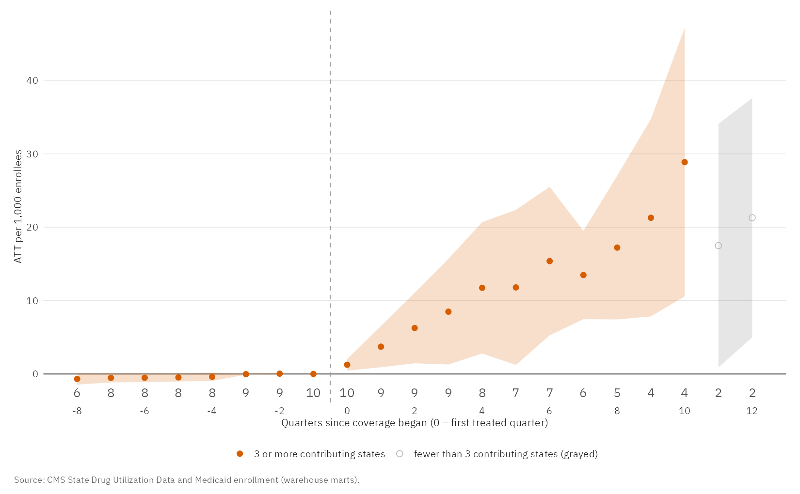
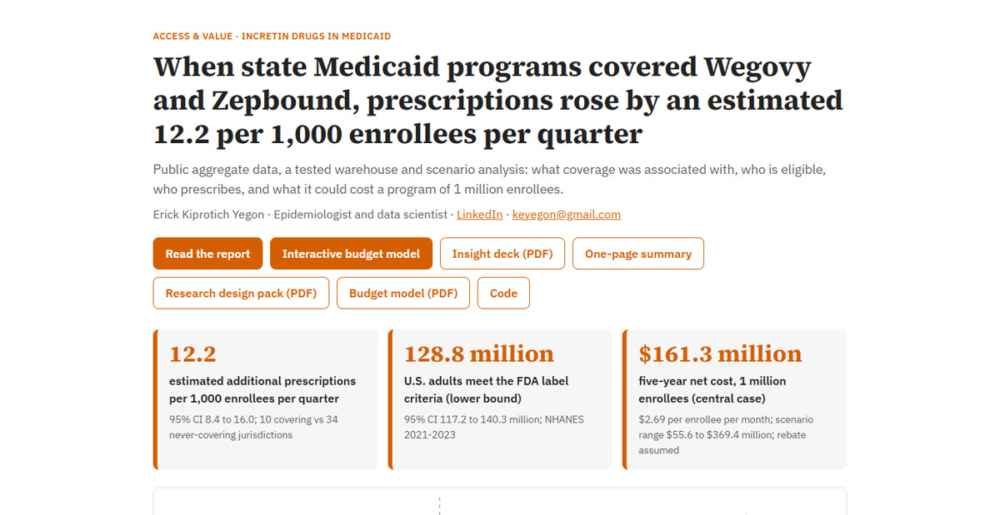
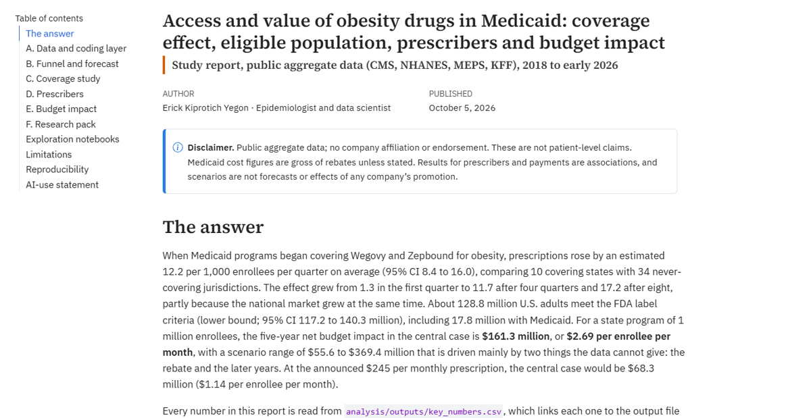
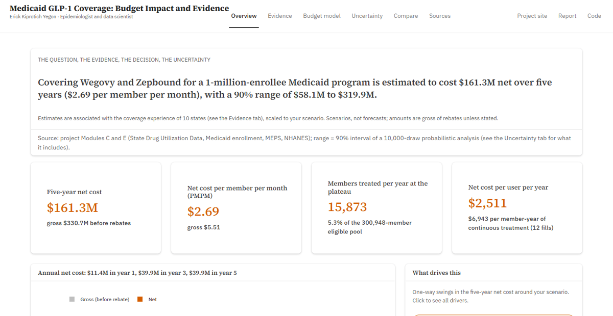
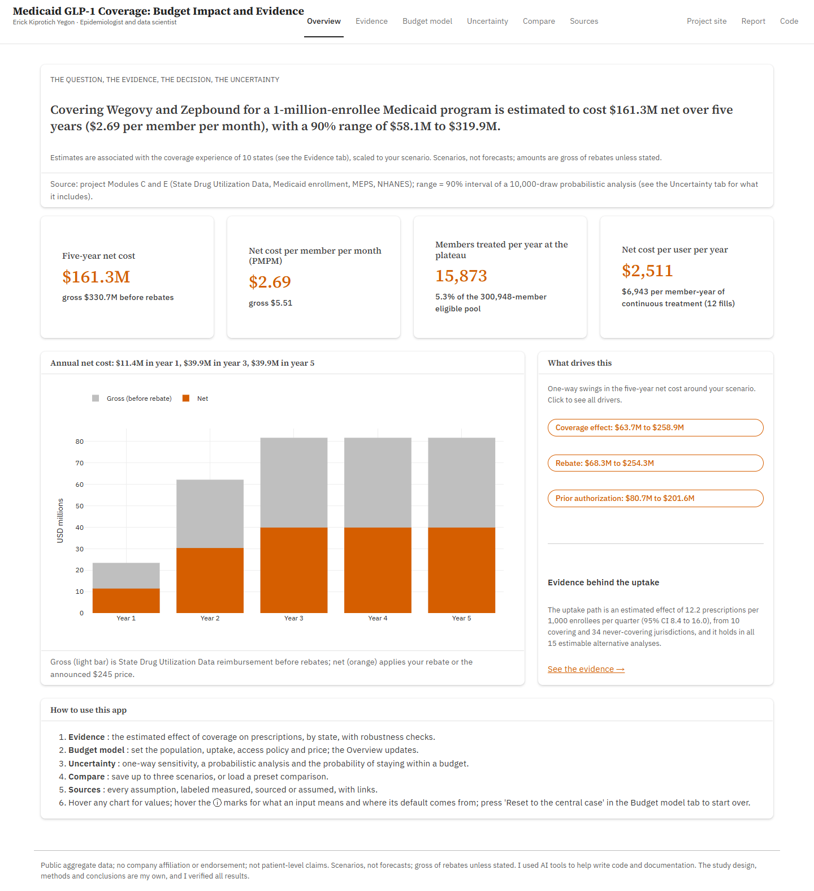
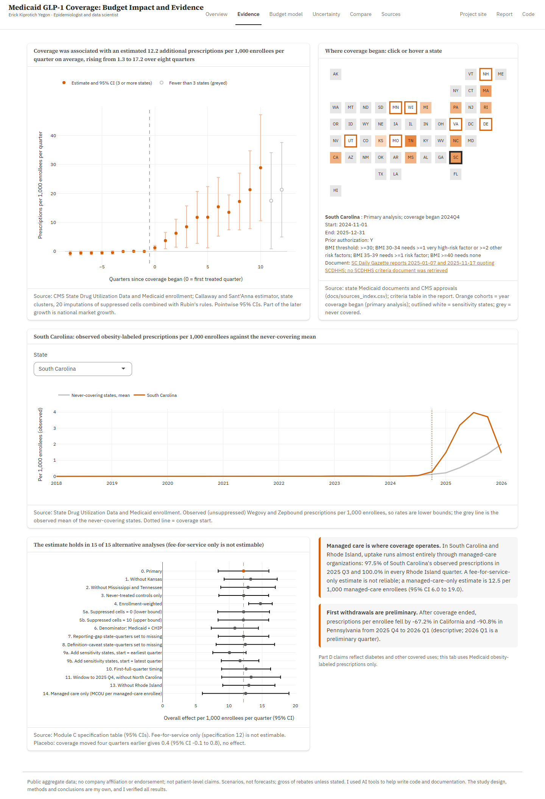
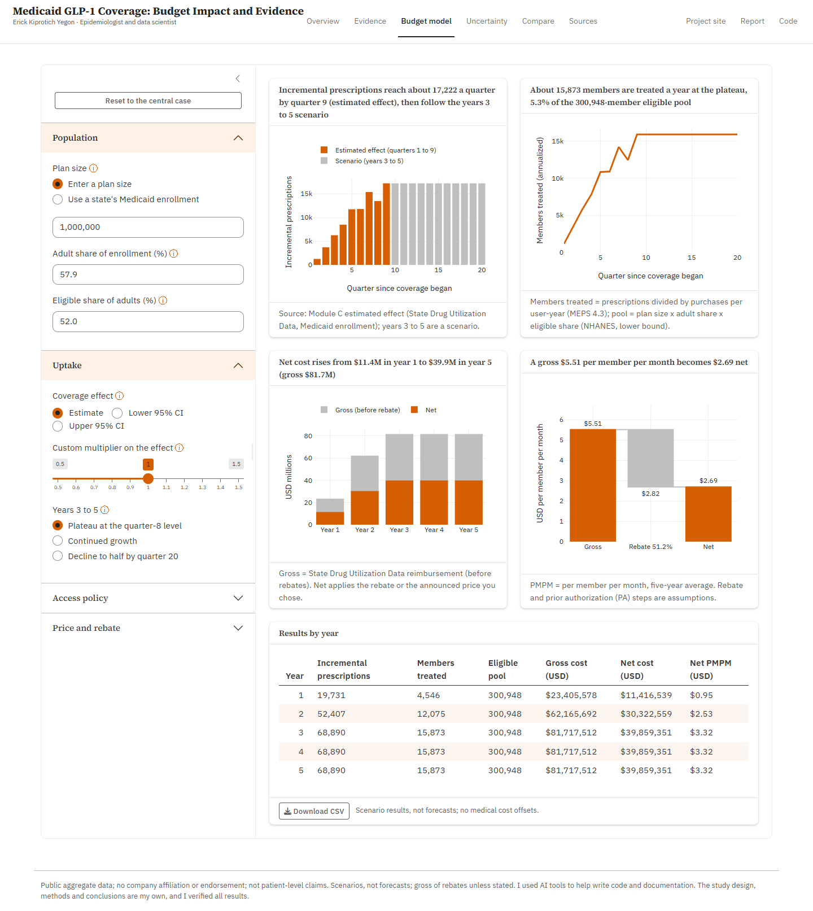
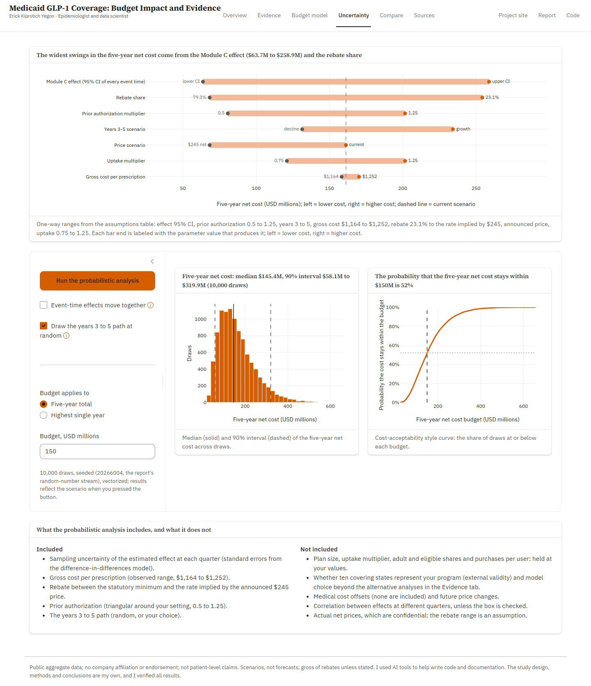
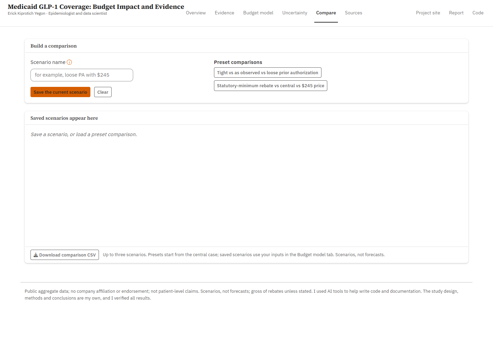
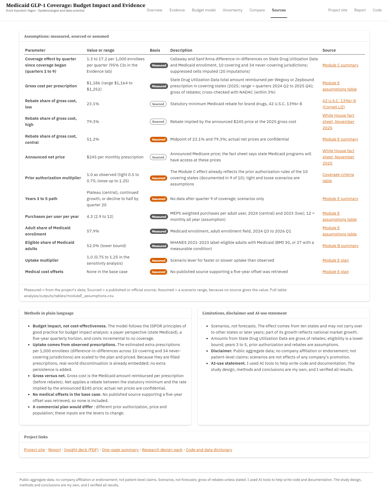

# Access and value of obesity drugs in Medicaid

When state Medicaid programs covered Wegovy and Zepbound, prescriptions rose by an estimated 12.2 per 1,000 enrollees per quarter; covering them for a 1-million-enrollee program would cost about $161.3 million net over five years. A public-data study with a tested warehouse (PostgreSQL, dbt), an R analysis, a Quarto report and an interactive budget model.

**[Project site](https://erickyegon.github.io/incretin-access-value/)** · **[Report](https://erickyegon.github.io/incretin-access-value/report.html)** · **[Interactive budget model](https://01a108a8-ecde-397c-5353-39196812b10c.share.connect.posit.cloud/)** · [Insight deck (PDF)](https://erickyegon.github.io/incretin-access-value/deck.pdf) · [One-page summary (PDF)](https://erickyegon.github.io/incretin-access-value/one_page_summary.pdf) · [Research design pack (PDF)](https://erickyegon.github.io/incretin-access-value/research_pack.pdf) · [Code](https://github.com/erickyegon/incretin-access-value)

| Project site | Report | Interactive budget model |
|---|---|---|
|  |  |  |

**Author:** Erick Kiprotich Yegon, epidemiologist and data scientist.

> Public aggregate data; no company affiliation or endorsement; not patient-level claims; gross of rebates unless stated; associations and scenarios, not effects of any company's promotion.

## Headline findings

All numbers come from [`analysis/outputs/key_numbers.csv`](analysis/outputs/key_numbers.csv), which links each one to its output file and row.

- **Coverage was associated with more prescriptions.** An estimated 12.2 additional Wegovy and Zepbound prescriptions per 1,000 Medicaid enrollees per quarter (95% CI 8.4 to 16.0), comparing 10 covering states with 34 never-covering jurisdictions. The effect rose from 1.3 in the first quarter to 17.2 after eight (part of the growth is national market growth), and it holds in all 15 estimable alternative analyses. A placebo gives 0.4 (95% CI -0.1 to 0.8).
- **Eligible adults.** 128.8 million U.S. adults meet the FDA label criteria (lower bound; 95% CI 117.2 to 140.3 million), including 17.8 million with Medicaid (95% CI 14.7 to 20.9 million).
- **Prescribers.** Primary care physicians wrote 55.8% and nurse practitioners and physician assistants 27.7% of Part D incretin claims in 2024; Part D reflects diabetes and other covered uses, not obesity-brand adoption.
- **Budget impact** for a program of 1 million enrollees: a net cost of about $161.3 million over five years in the central case ($2.69 per enrollee per month), with a scenario range of $55.6 to $369.4 million. The rebate is assumed (51.2% is the midpoint of 23.1% and 79.3%); at the announced $245 price the central case is $68.3 million.

## Deliverables

| What | Live | In the repository |
|---|---|---|
| Project site | [https://erickyegon.github.io/incretin-access-value/](https://erickyegon.github.io/incretin-access-value/) | `site/` |
| Study report (Quarto HTML) | [report](https://erickyegon.github.io/incretin-access-value/report.html) | `report/report.html` |
| Interactive budget model (Shiny decision tool) | [app](https://01a108a8-ecde-397c-5353-39196812b10c.share.connect.posit.cloud/) | `app/` |
| Insight deck (PDF) | [deck.pdf](https://erickyegon.github.io/incretin-access-value/deck.pdf) | `deck/deck.pdf` |
| One-page summary (PDF) | [one_page_summary.pdf](https://erickyegon.github.io/incretin-access-value/one_page_summary.pdf) | `deck/one_page_summary.pdf` |
| Research design pack (Module F, PDF) | [research_pack.pdf](https://erickyegon.github.io/incretin-access-value/research_pack.pdf) | `research_pack/research_pack.pdf` |
| Budget impact scenarios (PDF) | [budget_impact_scenarios.pdf](https://erickyegon.github.io/incretin-access-value/budget_impact_scenarios.pdf) | `analysis/outputs/budget_impact_scenarios.pdf` |
| Exploration notebooks, one per module A to E (HTML) | [notebooks](https://erickyegon.github.io/incretin-access-value/notebooks/C_coverage_study.html) | `notebooks/` |
| Coverage criteria table for the 17 covering states (prior authorization, BMI, comorbidity, step therapy) | [CSV](https://erickyegon.github.io/incretin-access-value/data/coverage_um_criteria.csv) | `analysis/outputs/tables/coverage_um_criteria.csv` |
| Trial efficacy inputs (STEP 1, SURMOUNT-1, SURMOUNT-5, ATTAIN-1) and value-context table | | `data/reference/trial_inputs.csv`, `analysis/outputs/tables/moduleE_value_context.csv` |
| Data dictionary (NDC not HCPCS, units, suppression) and generated mart dictionary | | `docs/data_dictionary.md`, `docs/data_dictionary_marts.md` |
| Pre-specified plans, deviations, summaries | | `analysis/plan_module*.md`, `analysis/analysis_plan_moduleC.md`, `analysis/outputs/deviations.md`, `analysis/outputs/module*_summary.md` |

## Interactive decision tool

[Open the app](https://01a108a8-ecde-397c-5353-39196812b10c.share.connect.posit.cloud/): evidence, budget model, uncertainty, scenario comparison and sources, built around the unchanged budget impact engine. The defaults equal the numbers in this README. Tests: `app/tests/` (testthat) and `scripts/test/test_app.js` (browser).

| Overview | Evidence | Budget model |
|---|---|---|
|  |  |  |
| **Uncertainty** | **Compare** | **Sources** |
|  |  |  |

## Related project

This is the second of two portfolio projects. The first, **Evidence**, is a real-world oncology study (NSCLC): <https://erickyegon.github.io/oncology-rwe-nsclc/>. This one is **Access & Value** (incretin drugs in Medicaid).

## Reproduce

Raw and interim data are not committed; the scripts download them and record their checksums in `data/manifest.csv`.

1. **Load.** `pip install -r requirements.txt`; run the scripts in `scripts/fetch` (in numeric order), then `scripts/load` to load the interim files into PostgreSQL (database `incretin`).
2. **Build.** `cd dbt && dbt deps && dbt seed && dbt build` (staging, intermediate and marts; the tests run with the build). Then `python scripts/build/build_counts.py`.
3. **Analyze.** `cd analysis` and `Rscript run_all.R` (packages pinned in `analysis/renv.lock`; R 4.6), then `Rscript scripts/50_key_numbers.R`. Figures use the project style system (`analysis/R/fig_style.R`: bundled IBM Plex Sans and Source Serif 4, report, deck and web variants).
4. **Render.** `quarto render report`, `quarto render deck` (then `node deck/make_pdf.js deck/deck.html deck/deck.pdf`), `quarto render research_pack` and `python site/build_site.py`. Run the Shiny app with `shiny::runApp("app")`.
5. **Audit.** `Rscript audit/check_numbers.R` checks that every public number matches `key_numbers.csv`; `Rscript audit/check_figures.R` checks every figure (type scale, clipping, overlap, alt text); `python audit/check_links.py` checks the links.

## Repository map

- `scripts/fetch`, `scripts/load`, `scripts/build`, `scripts/qa`, `scripts/test`: acquisition, loading, build, QA and test helpers.
- `dbt/`: staging, intermediate and marts models, seeds and tests (54 models, 10 seeds, 126 tests, counted from the dbt manifest). Lineage: `docs/figures/dbt_lineage.png`.
- `analysis/`: R project (renv), scripts by module (B, C, D, E), outputs (`tables`, `figures`, summaries), `key_numbers.csv`.
- `app/`: Shiny budget impact model. `report/`, `deck/`, `site/`, `research_pack/`: the deliverables above.
- `docs/`: data dictionary, warehouse notes and every source (`docs/sources_index.csv` lists URL, access date and checksum for all of them; U.S. government documents and open-license manuals are kept in `docs/sources`, copyrighted third-party copies are kept locally only).
- `audit/`: the number audit, figure QA and link check.

## Data sources

All were accessed between 2026-10-03 and 2026-10-04 (per-file dates, URLs and checksums in `data/manifest.csv`; all sources, kept or not, in `docs/sources_index.csv`). They are U.S. federal public data released for public use, and each agency's terms of use apply; the KFF poll results are cited from KFF's published pages.

- CMS Medicaid State Drug Utilization Data, Medicaid enrollment, NADAC, spending by drug (data.medicaid.gov, data.cms.gov)
- CMS Medicare Part D Prescribers by Provider and Drug; CMS Open Payments (general payments); NPPES; NUCC taxonomy
- NCHS NHANES 2021-2023 and 2017-March 2020; AHRQ MEPS 2023-2024
- FDA NDC directory, openFDA and Drugs@FDA labels; NLM RxNorm; CMS ICD-10-CM value sets; ClinicalTrials.gov
- State Medicaid policy documents and CMS approvals (`data/reference/medicaid_obesity_coverage.csv`); KFF Health Tracking Polls; CMS Medicare GLP-1 Bridge pages; White House fact sheet (November 2025); 42 U.S.C. 1396r-8

## Limitations

SDUD amounts are gross of rebates and the rebate range is an assumption; the coverage effect comes from 10 states and may not carry over; eligibility is a lower bound; Part D is not obesity use; suppressed cells are imputed; the budget model has no medical cost offsets; the prescriber analyses are descriptive associations; the forecast and budget model are scenarios, not forecasts. See the report for details.

## AI-use statement

I used AI tools to help write code and documentation. The study design, methods and conclusions are my own, and I verified all results.

## Contact

Erick Kiprotich Yegon, epidemiologist and data scientist · [LinkedIn](https://linkedin.com/in/erickyegon) · [keyegon@gmail.com](mailto:keyegon@gmail.com)
