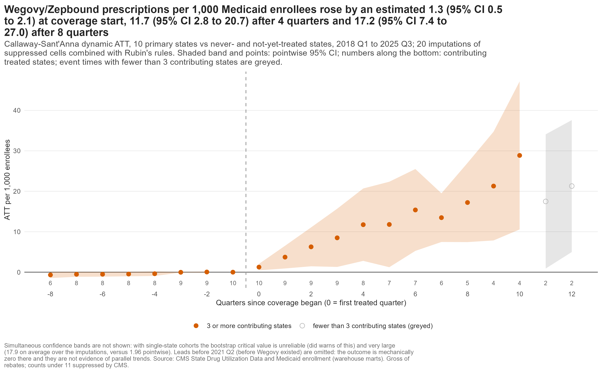

```{r setup}
source("../analysis/R/kn.R")
```

**Question.** What did Medicaid coverage of Wegovy and Zepbound do to prescriptions, how many adults are eligible, and what could coverage cost a program of 1 million enrollees over five years?

**Three findings**

1. **Coverage was associated with more prescriptions.** An estimated `r kn("c_att_overall")` additional prescriptions per 1,000 enrollees per quarter (`r kn_ci("c_att_overall")`), rising from `r kn("c_es_e0")` in the first quarter to `r kn("c_es_e8")` after eight; ten covering states against `r kn("c_states_never")` never-covering jurisdictions. A placebo shows `r kn("c_placebo")` (`r kn_ci("c_placebo")`).
2. **Many adults are eligible.** `r kn("b_eligible")` million U.S. adults meet the FDA label criteria (lower bound; `r kn_ci("b_eligible")` million), including `r kn("b_medicaid_elig")` million with Medicaid (`r kn_ci("b_medicaid_elig")` million).
3. **The budget depends on the rebate.** Central five-year net cost $`r kn("e_net5")` million ($`r kn("e_pmpm")` per enrollee per month; rebate `r kn("e_rebate_central")`% assumed); scenario range $`r kn("e_scen_min")` to $`r kn("e_scen_max")` million; $`r kn("e_announced5")` million at the announced $`r kn("x_price_245")` price.

{fig-alt="Event-study chart: the effect of Medicaid coverage on Wegovy and Zepbound prescriptions per 1,000 enrollees rises from near zero before coverage to about 17 after eight quarters." width=62%}

**Methods.** Public data (CMS Medicaid State Drug Utilization Data and enrollment, NHANES, MEPS, KFF polls); difference-in-differences for staggered adoption with imputed suppressed cells; survey-weighted eligibility; ISPOR-style budget impact model with probabilistic sensitivity analysis. Warehouse: PostgreSQL and dbt (`r kn("build_models")` models, `r kn("build_tests")` tests); analysis in R; Quarto and Shiny.

**Skills.** Real-world evidence · HEOR · market access · claims data · NDC coding · causal inference · budget impact · SQL · dbt · R · Quarto · Shiny.

**Links.** Code: github.com/erickyegon/incretin-access-value · Report: `report/report.html` · Deck: `deck/deck.pdf`.

*Public aggregate data; no company affiliation or endorsement; not patient-level claims; gross of rebates unless stated; scenarios, not forecasts. I used AI tools to help write code and documentation. The study design, methods and conclusions are my own, and I verified all results.*
