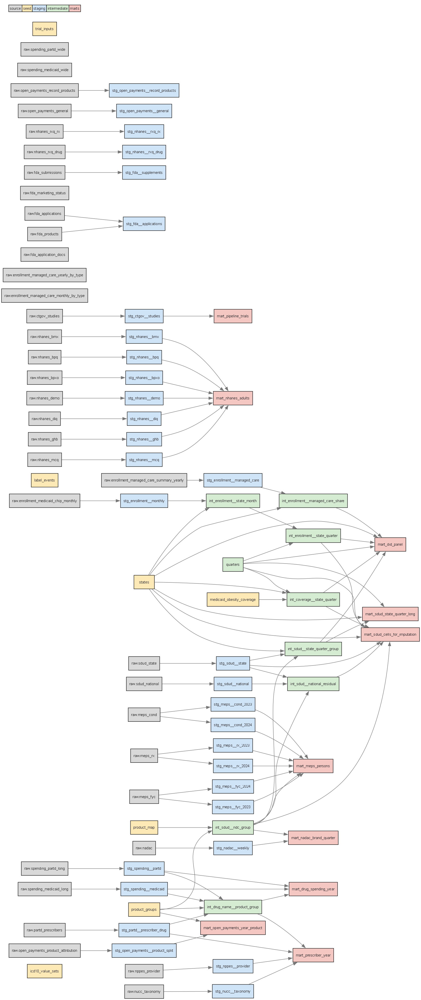

```{r setup}
source("../analysis/R/kn.R")
suppressPackageStartupMessages({ library(knitr) })
al <- read.csv("../analysis/outputs/figures/alt_text.csv", stringsAsFactors = FALSE)
tbl <- function(f) read.csv(file.path("../analysis/outputs/tables", f), check.names = FALSE, stringsAsFactors = FALSE)
# a static figure: the image already carries its finding-as-title; the caption gives the source and the alt text is read from outputs/figures/alt_text.csv
nt <- read.csv("../analysis/outputs/figures/figure_notes.csv", stringsAsFactors = FALSE)
fig <- function(name, src, width = "100%") {
  a <- al$alt_text[al$figure == name]; stopifnot(length(a) == 1)
  cap <- if (name %in% nt$figure) nt$notes[nt$figure == name] else src          # the source line is in the image; the notes (methods, caveats) are the caption
  cat(sprintf("{fig-alt=\"%s\" width=%s}\n\n", gsub("\n", " ", cap), name, gsub("\"", "'", a), width))
}
raw_html <- function(x) cat("

", strrep(intToUtf8(96), 3), "{=html}
", x, "
", strrep(intToUtf8(96), 3), "

", sep = "")
note <- function(...) cat("\n::: {.small}\n", paste0(...), "\n:::\n\n")
```

::: {.callout-note appearance="simple"}
**Disclaimer.** Public aggregate data; no company affiliation or endorsement. These are not patient-level claims. Medicaid cost figures are gross of rebates unless stated. Results for prescribers and payments are associations, and scenarios are not forecasts or effects of any company's promotion.
:::

# The answer

When Medicaid programs began covering Wegovy and Zepbound for obesity, prescriptions rose by an estimated `r kn("c_att_overall")` per 1,000 enrollees per quarter on average (`r kn_ci("c_att_overall")`), comparing `r kn("c_states_primary")` covering states with `r kn("c_states_never")` never-covering jurisdictions. The effect grew from `r kn("c_es_e0")` in the first quarter to `r kn("c_es_e4")` after four quarters and `r kn("c_es_e8")` after eight, partly because the national market grew at the same time. About `r kn("b_eligible")` million U.S. adults meet the FDA label criteria (lower bound; `r kn_ci("b_eligible")` million), including `r kn("b_medicaid_elig")` million with Medicaid. For a state program of 1 million enrollees, the five-year net budget impact in the central case is **$`r kn("e_net5")` million**, or **$`r kn("e_pmpm")` per enrollee per month**, with a scenario range of $`r kn("e_scen_min")` to $`r kn("e_scen_max")` million that is driven mainly by two things the data cannot give: the rebate and the later years. At the announced $245 per monthly prescription, the central case would be $`r kn("e_announced5")` million ($`r kn("e_announced_pmpm")` per enrollee per month).

Every number in this report is read from `analysis/outputs/key_numbers.csv`, which links each one to the output file and row it came from.

# A. Data and coding layer

::: {.lead}
A tested warehouse stands behind every number.
:::

Public sources were loaded into PostgreSQL and transformed with dbt: Medicaid State Drug Utilization Data (SDUD) and enrollment, Medicare Part D Prescribers, NADAC drug prices, Open Payments, NPPES and NUCC taxonomy, NHANES, MEPS, ICD-10-CM value sets, FDA labels and the NDC directory, and state policy documents. A product map assigns each NDC to a drug, brand and label group using the FDA label indications text. The build has `r kn("build_models")` dbt models (`r kn("build_models_staging")` staging, `r kn("build_models_intermediate")` intermediate, `r kn("build_models_marts")` marts), `r kn("build_seeds")` seeds and `r kn("build_tests")` tests, counted from the dbt manifest (`analysis/outputs/build_counts.csv`).

```{r lineage, results='asis'}
cat("{fig-alt=\"Directed graph of the dbt lineage from raw source tables through staging and intermediate models to the mart tables used by the analyses.\" width=100%}\n\n")
```

Pre-specified analysis plans were committed before any results of each module: Module C `d46bd57` (2026-10-04 06:16 -0400; amendment `f74da18`, 2026-10-04 07:09 -0400, before any model run), Module B `7909c7a` (2026-10-04 09:11 -0400), Module D `6d4234f` (2026-10-04 09:28 -0400) and Module E `993e8c8` (2026-10-04 09:39 -0400). Commit hashes changed when history was rewritten to remove personal metadata and third-party copies; dates and order are unchanged. Departures from the plans are logged in [`deviations.md`](https://github.com/erickyegon/incretin-access-value/blob/main/analysis/outputs/deviations.md) (items 1 to 17).

## Market context: spending, timeline and pipeline

```{r a-spend, results='asis'}
fig("50_spending_trend", "Source: CMS Medicare Part D Spending by Drug and Medicaid Spending by Drug; gross of rebates.")
```

Gross spending on GLP-1 and GIP products rose from $`r kn("m_spend_partd_2020")` billion in 2020 to $`r kn("m_spend_partd_2024")` billion in 2024 in Medicare Part D and from $`r kn("m_spend_medicaid_2020")` billion to $`r kn("m_spend_medicaid_2024")` billion in Medicaid. These are CMS spending figures **before manufacturer rebates**, so they overstate what programs pay. Ozempic ($`r kn("m_spend_partd_ozempic_2024")` billion) and Mounjaro ($`r kn("m_spend_partd_mounjaro_2024")` billion) lead in Part D in 2024, mostly diabetes use; in Medicaid, Wegovy ($`r kn("m_spend_medicaid_wegovy_2024")` billion) is the largest obesity-labeled brand.

```{r a-timeline, results='asis'}
fig("51_timeline", "Sources: Drugs@FDA labels; state Medicaid documents; White House fact sheet, November 2025; CMS Medicare GLP-1 Bridge pages.")
```

The pipeline of registered studies (ClinicalTrials.gov, in-scope ingredients only: semaglutide, tirzepatide, liraglutide, dulaglutide, exenatide and orforglipron) has `r kn("p_obesity_studies")` studies listing obesity, of which `r kn("p_obesity_studies_ongoing")` are ongoing and `r kn("p_obesity_phase3_ongoing")` are ongoing Phase 3. Oral programs account for `r kn("p_oral_obesity_studies")` obesity studies (`r kn("p_oral_obesity_phase3_ongoing")` ongoing Phase 3; "oral" is matched on orforglipron or oral or tablet text and is approximate), and orforglipron alone has `r kn("p_orforglipron_obesity_studies")` obesity studies, `r kn("p_orforglipron_phase3_obesity_studies")` of them Phase 3. Programs of other ingredients are not counted.

```{r a-pipeline}
knitr::kable(tbl("moduleA_pipeline_by_phase.csv"), col.names = c("Registered phase", "Obesity studies", "Ongoing"))
```

```{r a-report, results='asis'}
fig("52_sdud_reporting_suppression", "Source: CMS State Drug Utilization Data via the warehouse panel; counts under 11 are suppressed by CMS.")
```

The reporting heatmap shows that `r kn("m_rep_both")`% of state-quarters have both fee-for-service and managed-care rows and `r kn("m_rep_ffsu_only")`% have fee-for-service rows only; `r kn("m_wz_suppressed_share")`% of Wegovy and Zepbound rows are suppressed (counts under 11), which is why Module C imputes suppressed cells.

# B. Funnel and forecast

::: {.lead}
About half of U.S. adults meet the label criteria, and use is rising.
:::

```{r b-fig, results='asis'}
fig("20_funnel", "Source: NHANES 2021-2023 (measured steps); KFF poll February 24 to March 2, 2026 (modeled steps).")
```

Of `r kn("b_adults")` million adults, `r kn("b_eligible")` million (`r kn("b_elig_pct")`% of adults with the measure) are label-eligible by BMI of 30 or more, or BMI 27 to 29.9 with a measurable weight-related condition. This is a lower bound, because some qualifying conditions are not measured in NHANES. Among adults with Medicaid (`r kn("b_medicaid_adults")` million), `r kn("b_medicaid_elig")` million (`r kn("b_medicaid_elig_share")`%) are eligible. The measurable part of the Medicare GLP-1 Bridge criteria covers `r kn("b_bridge")` million adults aged 65 and over. KFF's poll puts current GLP-1 use at `r kn("b_glp1_all")` million adults (`r kn_ci("b_glp1_all")`), of whom about `r kn("b_glp1_nodiab")` million do not have diagnosed diabetes (a weight-management proxy, modeled).

```{r b-fig2, results='asis'}
fig("21_forecast_fan", "Source: scenario simulation (10,000 draws) over assumed ranges; scenarios, not a prediction.")
```

The forecast of GLP-1 users without diagnosed diabetes reaches a median of `r kn("b_fc_2030")` million by end-2030 (90% interval `r sub("90% interval ", "", kn_ci("b_fc_2030"))`) from `r kn("b_fc_2026")` million in 2026; the downside, base and upside parameter sets give `r kn("b_scen_downside")`, `r kn("b_scen_base")` and `r kn("b_scen_upside")` million. The ranges are assumptions about uptake, retention and the Medicare Bridge, listed in the [assumptions table](../analysis/outputs/tables/moduleB_assumptions.csv).

# C. Coverage study

::: {.lead}
Coverage was associated with more prescriptions, quickly at first and more over time.
:::

```{r c-map, results='asis'}
fig("01_coverage_timing_map", "Source: state Medicaid documents and CMS approvals saved in docs/sources; coverage_start dates in data/reference/medicaid_obesity_coverage.csv.")
```

The map shows the `r kn("c_states_primary")` states in the primary analysis; `r kn("c_states_sens")` more with uncertain start quarters appear only in a sensitivity analysis. Prior authorization is documented in `r kn("c_pa_states")` of the covering states (California's is not found in sourced documents), and BMI thresholds, comorbidity rules and step therapy are in the criteria table below.

```{r c-es-fig, results='asis'}
fig("10_event_study_primary", "Source: CMS State Drug Utilization Data and Medicaid enrollment (analysis/outputs/tables/event_study_primary.csv).")
```


```{r c-um, results='asis'}
um <- read.csv("../analysis/outputs/tables/coverage_um_criteria.csv", check.names = FALSE, stringsAsFactors = FALSE)
yn <- function(x) ifelse(is.na(x) | !nzchar(x) | grepl("^not found", x, ignore.case = TRUE), "Not found", ifelse(grepl("^N(o)?([^a-z]|$)", x), "No", "Yes"))
short <- function(x, n = 46) { x <- gsub(">=", "\u2265 ", x, fixed = TRUE); x <- sub("; .*$", "", x); ifelse(grepl("^not found", x, ignore.case = TRUE), "Not found", ifelse(nchar(x) > n, paste0(substr(x, 1, n - 1), "\u2026"), x)) }
compact <- data.frame(State = um$State, `Delivery system` = short(um[["Delivery system"]], 34), `Prior authorization` = yn(um[["Prior authorization"]]), `BMI rule` = short(um[["BMI threshold"]]), Comorbidity = yn(um[["Comorbidity requirement"]]), `Step therapy` = yn(um[["Step therapy"]]),
                      Source = ifelse(nzchar(um[["Source URL"]]), sprintf("[link](%s)", um[["Source URL"]]), ""), check.names = FALSE, stringsAsFactors = FALSE)
raw_html(gt::as_raw_html(gt::gt(compact) |> gt::fmt_markdown(columns = "Source") |> gt::tab_header(title = "Utilization-management criteria in the 17 covering states", subtitle = "Compact view; 'Not found' means no sourced document states it; criteria differ by period") |>
  gt::cols_width(State ~ gt::px(120), `Delivery system` ~ gt::px(190), `Prior authorization` ~ gt::px(90), `BMI rule` ~ gt::px(240), Comorbidity ~ gt::px(90), `Step therapy` ~ gt::px(80), Source ~ gt::px(60)) |> gt::opt_row_striping() |>
  gt::tab_source_note("Sources: state Medicaid agency documents; South Carolina's criteria are as reported by a news outlet quoting the state agency.") |> gt::tab_options(table.font.size = gt::px(12), data_row.padding = gt::px(4), column_labels.font.size = gt::px(11)) |>
  gt::opt_css("th { font-variant: small-caps; letter-spacing: .03em; }")))
cat("\n\n<details><summary>Full criteria text for all 17 states</summary>\n\n")
raw_html(gt::as_raw_html(gt::gt(um[, c("State", "Delivery system", "Prior authorization", "BMI threshold", "Comorbidity requirement", "Step therapy", "Criteria version (document)")]) |> gt::opt_row_striping() |> gt::tab_options(table.font.size = gt::px(11), data_row.padding = gt::px(3))))
cat("\n\n</details>\n\n")
```

The full table is [coverage_um_criteria.csv](../analysis/outputs/tables/coverage_um_criteria.csv): prior authorization is documented for `r kn("um_pa")` of 17 states, BMI thresholds for `r kn("um_bmi")`, comorbidity rules for `r kn("um_comorb")` and step therapy for `r kn("um_step")`. Tennessee requires prior authorization (TennCare notice, August 2025: BMI 30, or 27 with a weight-related condition). In 2025 Q3, states with active coverage filled `r kn("m_rate_cov_2025q3")` Wegovy and Zepbound prescriptions per 1,000 enrollees against `r kn("m_rate_non_2025q3")` elsewhere:

```{r c-rate, results='asis'}
fig("53_rate_map_2025Q3", "Source: CMS State Drug Utilization Data and Medicaid enrollment; observed counts only.")
```

The overall effect is `r kn("c_att_overall")` per 1,000 enrollees per quarter (`r kn_ci("c_att_overall")`). The estimate holds in all `r sub(" of .*$", "", kn("c_spec_holds"))` estimable alternative analyses (fee-for-service only, specification 12, is not estimable). A different estimator (Sun and Abraham) gives `r kn("c_sa")` (`r kn_ci("c_sa")`), a wild cluster bootstrap by state gives an interval of `r sub("wild bootstrap 95% interval ", "", kn_ci("c_wild"))`, and the sensitivity analyses range from `r kn("c_spec_range")`. A managed-care-only outcome (sensitivity 14, per managed-care enrollee, so a different denominator) gives `r kn("c_spec14")` (`r kn_ci("c_spec14")`). A placebo with coverage moved four quarters earlier gives `r kn("c_placebo")` (`r kn_ci("c_placebo")`). The result tolerates a violation of parallel trends up to `r kn("c_honest_mbar")` times the largest pre-period violation (HonestDiD). Saxenda (`r kn("c_saxenda")`, `r kn_ci("c_saxenda")`) and diabetes GLP-1 products (`r kn("c_diab_glp1")`, `r kn_ci("c_diab_glp1")`) show no effect.

```{r c-fig2, results='asis'}
fig("11_specification_chart", "Source: Module C specification table (analysis/outputs/tables/specification_table_raw.csv).")
fig("05_withdrawal_descriptive", "Source: SDUD 2025 Q4 to 2026 Q1 (2026 Q1 is a preliminary quarter); descriptive only.")
```

Managed care is where coverage operates in South Carolina and Rhode Island, so a fee-for-service-only estimate is not reliable (deviation 6). After coverage ended, prescriptions per enrollee fell by `r kn("c_withdraw_ca")`% in California and `r kn("c_withdraw_pa")`% in Pennsylvania from 2025 Q4 to 2026 Q1 (preliminary, descriptive).

# D. Prescribers

::: {.lead}
Primary care writes most Part D incretin claims, which reflect diabetes and other covered uses.
:::

::: {.callout-warning appearance="simple"}
Part D reflects diabetes and other covered uses, not obesity-brand adoption.
:::

```{r d-fig, results='asis'}
fig("31_partd_specialty_mix", "Source: CMS Medicare Part D Prescribers by Provider and Drug (rows with at least 11 claims); specialty from CMS prescriber type.")
```

Part D incretin claims grew from `r kn("d_claims_2018")` million in 2018 to `r kn("d_claims_2024")` million in 2024, and prescribers from `r kn("d_prescribers_2018")` to `r kn("d_prescribers_2024")`. In 2024, primary care physicians wrote `r kn("d_share_pcp")`% of claims, nurse practitioners and physician assistants `r kn("d_share_nppa")`%, endocrinology `r kn("d_share_endo")`% and cardiology `r kn("d_share_cardio")`%; the NPPES taxonomy agrees with the specialty grouping for `r kn("d_nppes_agree")`% of prescribers. The top 10% of prescribers wrote `r kn("d_top10_2018")`% of claims in 2018 and `r kn("d_top10_2024")`% in 2024 (Gini `r kn("d_gini_2024")` in 2024).

```{r d-fig2, results='asis'}
fig("33_partd_tirzepatide_adoption", "Source: CMS Medicare Part D Prescribers; Part D reflects diabetes and other covered uses.")
fig("34_partd_wegovy_vs_ozempic_specialty", "Source: CMS Medicare Part D Prescribers, 2024; Wegovy's Part D claims reflect its cardiovascular indication, not obesity use.")
```

The share of prescribers with tirzepatide claims rose from `r kn("d_tirz_2022")`% in 2022 to `r kn("d_tirz_2023")`% in 2023 and `r kn("d_tirz_2024")`% in 2024. Wegovy had `r kn("d_wegovy_claims")` Part D claims from `r kn("d_wegovy_prescribers")` prescribers in 2024; cardiology wrote `r kn("d_wegovy_cardio")`% of them against `r kn("d_ozempic_cardio")`% of Ozempic claims, consistent with the cardiovascular indication added in March 2024.

**Segments (exploratory).** The pre-specified rule gave a two-segment split of new versus continuing prescribers. A supplementary five-segment solution, shown with its stability beside each segment, is exploratory:

```{r d-fig3, results='asis'}
fig("35_partd_segments_k5", "Source: CMS Medicare Part D Prescribers 2023-2024, NPPES; exploratory five-segment solution (k-prototypes); stability = mean Jaccard over 50 bootstrap resamples.")
```

**Open Payments (association only; technical report, not for headlines).** In 2023, `r kn("d_pay_share")`% of 2024 prescribers had in-scope payments. The negative binomial model uses log(1 + dollars) as the predictor, so a "per $1,000" statement would be wrong; the clear contrasts are incidence rate ratios for 2024 claims: any 2023 payment versus none at the median payee amount, `r kn("d_pay_irr_any")` (`r kn_ci("d_pay_irr_any")`), and `r kn("d_pay_irr_doubling")` (`r kn_ci("d_pay_irr_doubling")`) per doubling of the amount among payees. Payments go to prescribers who already write more; these are associations, not effects of payments, and no individual or company is identified.

```{r d-fig4, results='asis'}
fig("36_payments_binned", "Source: CMS Medicare Part D Prescribers and Open Payments general payments (aggregate bins); association only.")
```

# E. Budget impact

::: {.lead}
About $161 million over five years for 1 million enrollees, with the rebate the biggest unknown.
:::

The model scales Module C's extra prescriptions per 1,000 enrollees to a program of 1 million enrollees and prices them. Module C measures filled prescriptions in states that already applied their own prior authorization rules, so the central case uses the effect as observed (multiplier 1.0, "PA as observed in the 10 covering states"); tight and loose prior authorization are assumption scenarios. The central rebate is `r kn("e_rebate_central")`% (midpoint of `r kn("e_rebate_low")`% and `r kn("e_rebate_high")`%), where `r kn("e_rebate_low")`% is the statutory minimum (42 U.S.C. 1396r-8) and `r kn("e_rebate_high")`% is the rebate implied by the announced $`r kn("x_price_245")` price; actual net prices are confidential. No medical cost offsets are included because no published source supporting a five-year offset was retrieved.

```{r e-fig, results='asis'}
fig("42_cost_by_scenario", "Source: Module C effects; SDUD gross reimbursement; statutory rebate floor; White House fact sheet, November 2025. Rebates, prior authorization and years 3-5 are assumptions.")
```

In the central case the five-year net cost is $`r kn("e_net5")` million ($`r kn("e_pmpm")` per enrollee per month; gross $`r kn("e_gross5")` million, $`r kn("e_gross_pmpm")` per month), with $`r kn("e_year1_net")`, $`r kn("e_year2_net")` and $`r kn("e_year3_net")` million in years 1 to 3. About `r kn("e_users")` members a year are users at the plateau, out of `r kn("e_pool")` eligible Medicaid adults in the plan. Two per-member costs answer different questions: **net cost per user per year** (4.3 fills a year, MEPS, sourced) is $`r kn("e_per_user_year")`, and **net cost per member-year of continuous treatment** (12 fills a year, assumption) is $`r kn("e_per_member_year_cont")`. The gross reimbursement per prescription is $`r kn("e_gross_rx")` (`r kn_ci("e_gross_rx")`), measured in SDUD and consistent with NADAC within 3%.

The probabilistic range (10,000 draws) has a median of $`r kn("e_psa_median")` million (`r kn_ci("e_psa_median")` million), or $`r kn("e_psa_common")` million if the effects at different event times move together. Prior authorization scenarios (five-year net, central rebate): tight at multiplier 0.5, $`r kn("e_pa_05")` million; tight at 0.75, $`r kn("e_pa_075")` million; loose at 1.25, $`r kn("e_pa_125")` million.

```{r e-tornado-fig, results='asis'}
fig("40_tornado", "Source: Module E one-way sensitivity (analysis/outputs/tables/moduleE_tornado.csv).")
```

```{r e-fig2, results='asis'}
fig("41_waterfall_pmpm", "Source: Module E; rebate step is an assumption; $245 is an announced program price.")
fig("43_psa_distribution", "Source: Module E probabilistic sensitivity analysis, 10,000 draws.")
```

## Value context: trial efficacy next to net cost (context only)

```{r e-value}
vc <- read.csv("../analysis/outputs/tables/moduleE_value_context.csv", check.names = FALSE, stringsAsFactors = FALSE)
gt::gt(vc[, 1:8]) |> gt::tab_header(title = "Trial weight loss and Medicaid net cost per user per year", subtitle = "Context only: different populations, durations and fills; no cost-effectiveness claim") |>
  gt::tab_source_note("Trials: published abstracts via PubMed (STEP 1, SURMOUNT-1, SURMOUNT-5, ATTAIN-1; citations and DOIs in data/reference/trial_inputs.csv). Costs: Module E, net of an assumed rebate of 51.2%; one blended Wegovy and Zepbound net cost is shown for every row.") |> gt::tab_options(table.font.size = gt::px(10), data_row.padding = gt::px(3))
```

Published primary results range from `r kn("t_attain_1_orforglipron_6_mg")`% (orforglipron 6 mg, 72 weeks) to `r kn("t_surmount_1_tirzepatide_15_mg")`% (tirzepatide 15 mg, 72 weeks) mean body-weight change; semaglutide 2.4 mg gave `r kn("t_step_1_semaglutide")`% at 68 weeks (STEP 1) and head-to-head tirzepatide gave `r kn("t_surmount_5_tirzepatide")`% against `r kn("t_surmount_5_semaglutide")`% for semaglutide (SURMOUNT-5). Against these, the Module E central net cost is $`r kn("e_per_user_year")` per user per year (4.3 fills, MEPS) and $`r kn("e_per_member_year_cont")` per member-year of continuous treatment (12 fills, assumption). The trials, populations, durations and Medicaid fills differ, so this table supports no cost-effectiveness, cost-per-kilogram or QALY statement.

The interactive model is a hosted decision tool at <https://erickyegon.github.io/incretin-access-value/budget-model.html> (also runnable locally with `shiny::runApp("app")`); a static PDF of the scenarios is in `analysis/outputs/budget_impact_scenarios.pdf`.

# F. Research pack

::: {.lead}
A design for primary research, with no fieldwork done.
:::

Module F is a design pack, rendered as `research_pack/research_pack.pdf`: a one-page brief from a fictional access team, prescriber and payer screeners with quotas, a 60-minute discussion guide with probes tied to the findings above, fictional stimulus boards, a discrete choice experiment (five attributes, three levels, 24 tasks in two blocks of 12, an efficient design from `idefix` with a zero prior), sample size by the Johnson and Orme rule of thumb and by simulation, and an analysis framework. No respondents exist and no interviews have been fielded; the recommendation slides are marked illustrative and carry only secondary-data numbers.

# Exploration notebooks

One short notebook per module, built only from the existing outputs (no new analysis): [A, data layer](../notebooks/A_data_layer.html), [B, eligible population](../notebooks/B_eligible_population.html), [C, coverage study](../notebooks/C_coverage_study.html), [D, prescribers](../notebooks/D_prescribers.html) and [E, budget impact](../notebooks/E_budget_impact.html). The data dictionary (marts, units, suppression, NDC rather than HCPCS) is [docs/data_dictionary.md](https://github.com/erickyegon/incretin-access-value/blob/main/docs/data_dictionary.md).

# Limitations

- **Gross, not net.** SDUD amounts are gross of rebates; the rebate range is an assumption between a statutory floor and a price-implied ceiling.
- **Ten treated states.** The effect comes from `r kn("c_states_primary")` states and may not carry over to other states or later years; later event times fall in later calendar quarters, so part of the growth is market growth.
- **Eligibility is a lower bound.** NHANES does not measure every qualifying condition; modeled use steps rely on KFF poll estimates.
- **Part D is not obesity use.** Part D claims reflect diabetes and other covered uses; prescriber findings are not about obesity-brand adoption.
- **Suppressed cells.** SDUD hides counts under 11; the analysis imputes them and combines 20 imputations.
- **No offsets, no outcomes.** The budget model has no medical cost offsets and does not estimate health outcomes.
- **Associations, scenarios.** Payments results are associations; the budget model and forecast are scenarios, not forecasts.
- **Preliminary data.** SDUD 2026 Q1 is preliminary; the withdrawal figures are descriptive.

# Reproducibility

The code, the dbt project and the scripts are in the repository; raw and interim data are not committed and are re-downloaded by the scripts in `scripts/fetch`. In order: load (`scripts/load`), build (`dbt build` in `dbt/`), analyze (`analysis/run_all.R`, then `scripts/build/build_counts.py` and `analysis/scripts/50_key_numbers.R`), render (`quarto render report`, `deck`, `research_pack`). Every source is listed with its URL, access date and checksum in `docs/sources_index.csv`; U.S. government documents and open-license manuals are kept in `docs/sources/`, and copies of copyrighted third-party pages stay local only, and the R packages are pinned in `analysis/renv.lock`.

# AI-use statement

I used AI tools to help write code and documentation. The study design, methods and conclusions are my own, and I verified all results.
